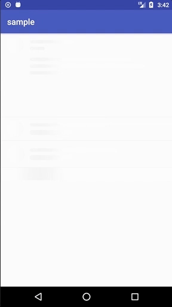

# SkeletonLoadingView
[](https://bintray.com/omjoonkim/maven/skeleton-loading-view) [](https://android-arsenal.com/details/1/5912)

SkeletonLoadingView with Kotlin 💀💀




## Requirements

minApi 12+

## Usage

```
	<com.omjoonkim.skeletonloadingview.SkeletonLoadingView
			android:id="@+id/skeletonView"
			android:layout_width="100dp"
			android:layout_height="12dp"
			app:baseColor="#fbfbfb" //customize baseColor  default : #fbfbfb
			app:deepColor="#f2f2f2" //customize deepColor  default : #f2f2f2
			app:duration="1500" //customize duration  default : 1500
			app:interval="1000" //customize interval of animation  default : 0
			app:progressLength="120dp" //customize progressLength  default : 120dp
			app:radius="5dp" //customize radius default : 5dp
			app:autoStart="true" //customize autoStart. default : true
			/>
```

### Integration

add to your app build.gradle

```
dependencies {
    compile 'com.omjoonkim.library:skeleton-loading-view:0.1.1'
}
```

## Contribute

always welcome 👐 Only pull request.
